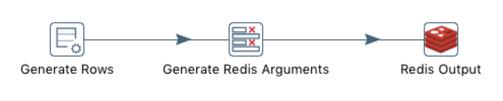

pdi-redis-plugin
====================

This is an output step plugin to write data to redis cluster.

install
====================

run "mvn clean package" with jdk7+, it will generate a zip file in target, extract it to kettle/plugins.

the directory layout would be:
```
$KETTLE_HOME/plugins/kettle-redis-plugin-$VERSION
  kettle-redis-plugin-$VERSION.jar
  lib
```

usage
====================

Open the output dialog, type in the command and the connection url, then the columns will be automatically
 appended as arguments, this plugin will generate the command and send to redis.


 e,g. zadd, then "zadd (column1 as key) (column2 as score) (column3 as member)" will be executed.

 e,g. set, then "set (column1 as key) (column2 as value)" will be executed.

You probably need a "select values" step before the redis output step to generate columns you want.



others
====================
Currently supported commands: set, del, sadd, srem, zadd, zrem
Redis cluster 3+ is supported, single node mode is not supported.
This is tested with Pentaho Kettle 6.1, should work with 7+.
JDK7+ is required.
